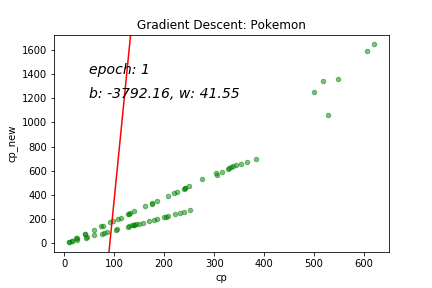

# machine-learning-classical-algorithm

🧠 机器学习经典算法

> 「纸上得来终觉，绝知此事要躬行」

## 1 数据集

### 1. Iris（分类）

- [数据介绍](https://www.v2ai.cn/ml/2018/06/30/ML-3.html)
- [数据来源](https://archive.ics.uci.edu/ml/datasets/iris)

### 2. Pokemon（回归）

- [数据介绍](https://www.v2ai.cn/ml/2019/04/25/ML-10.html)
- [数据来源](https://www.openintro.org/stat/data/?data=pokemon)

## 2 准备

```bash
# 克隆代码
git clone https://github.com/HaveTwoBrush/machine-learning-classical-algorithm.git

cd machine-learning-classical-algorithm

# 安装依赖
pip install -r requirements.txt
```

## 3 算法

### 1. KNN

`k-近邻算法` 采用测量不同特征值之间的距离方法进行分类。

```bash
python -m KNN.knn
```

### 2. LR

`线性回归` 是一种用来确定一个或多个自变量和因变量之间关系的回归分析方法。

```bash
# 最小二乘法
python -m LR.least_squares

# 梯度下降法
python -m LR.gradient_descent
```



参考文章：[预测「宝可梦」升级后的战斗力](https://www.v2ai.cn/ml/2018/08/31/ML-6.html)

## 4 License

[MIT License](./LICENSE)